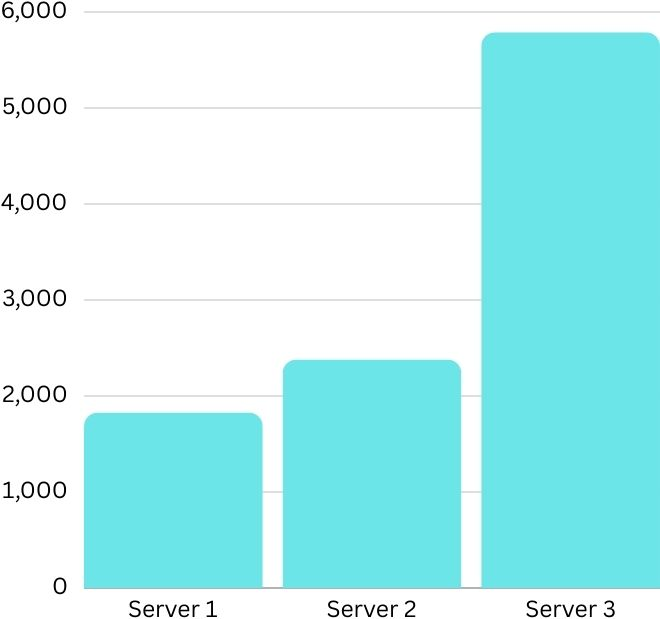
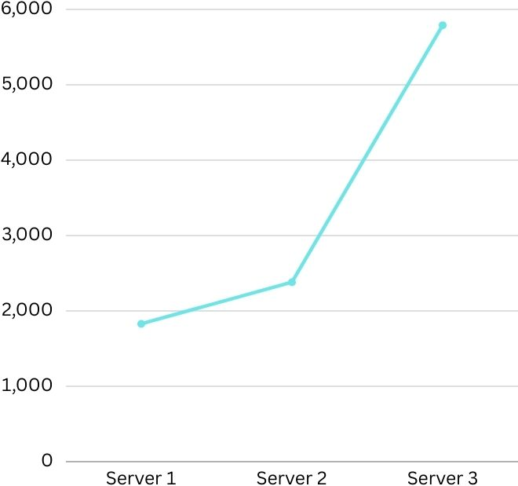
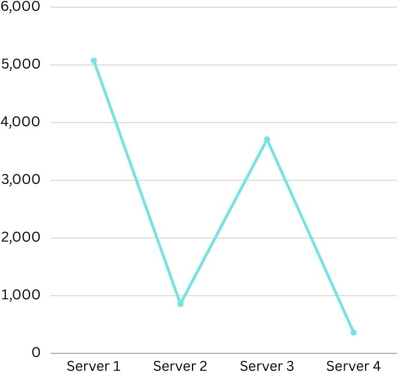
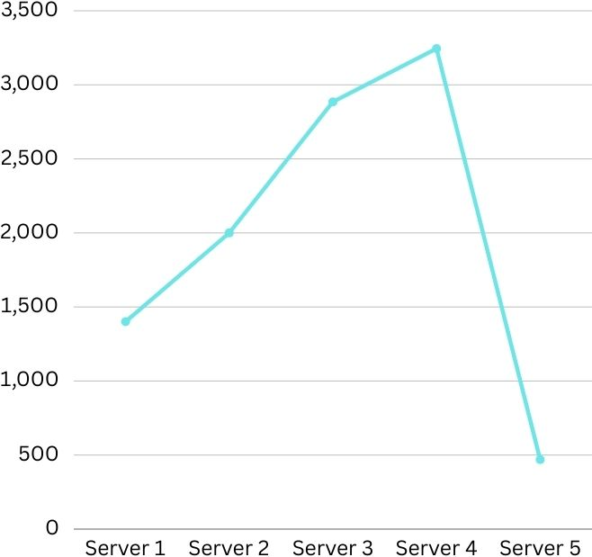
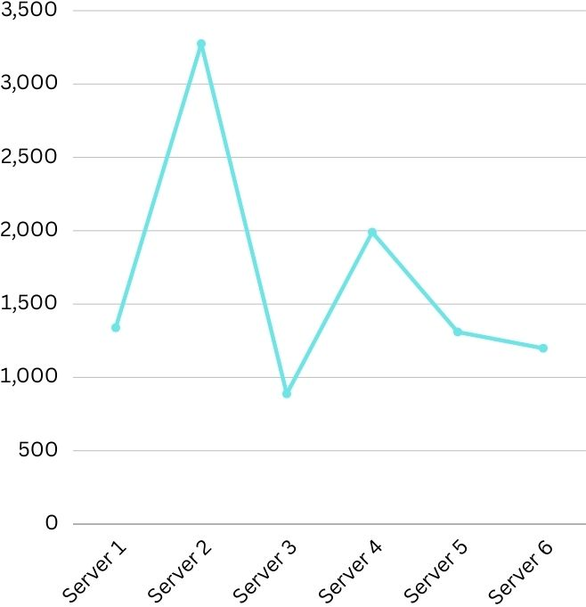

# Customizable-Load-Balancer
Analysis:

Launching requests to the servers instructions and code:

A-1:

Launched 10000 async requests on N = 3 server containers and reported the request count handled by each server instance in a bar chart

The above image suggests that server 3 is the one handling more than 50% of the total requests. The hash function in the load balancer handles the no of requests going to all servers which divides the requests unequally like shown.

A-2:

Launched 10000 async requests on N = 2 server containers and reported the request count handled by each server instance in a bar chart

The above image suggests that server 1 is the one handling more than 80% of the total requests. The hash function in the load balancer handles the no of requests going to all servers which divides the requests unequally like shown.

Launched 10000 async requests on N = 3 server containers and reported the request count handled by each server instance in a bar chart

The above image suggests that server 3 is the one handling more than 50% of the total requests. The hash function in the load balancer handles the no of requests going to all servers which divides the requests unequally like shown.

Launched 10000 async requests on N = 4 server containers and reported the request count handled by each server instance in a bar chart

The above image suggests that server 1 and server are the ones handling more than 80% of the total requests. The hash function in the load balancer handles the no of requests going to all servers which divides the requests unequally like shown.

Launched 10000 async requests on N = 5 server containers and reported the request count handled by each server instance in a bar chart

The above image suggests that servers 1,2,3,4 handle almost similar no of requests but server 5 handles less than 10% of the total requests. The hash function in the load balancer handles the no of requests going to all servers which divides the requests unequally like shown.

Launched 10000 async requests on N = 6 server containers and reported the request count handled by each server instance in a bar chart

The above image suggests that all servers handle almost similar percentage of the total number of requests. The hash function in the load balancer handles the no of requests going to all servers which divides the requests unequally like shown.

The above results show that as the number of servers increase the percentage gets divided more and more evenly and all servers have near similar no of requests to handle. The hash function controls these numbers and is designed to equalize as the number of servers increase.

